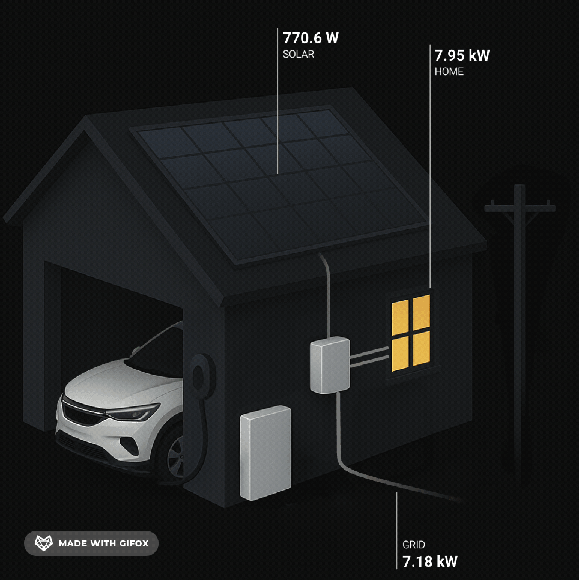

# 🌞 Home Assistant Modern Solar Energy Card 

[](https://opensource.org/licenses/MIT)
[]()

A sleek, modern-looking live dashboard for solar energy monitoring in Home Assistant. This card provides a Tesla-inspired interface for visualizing your home's energy flow including:

- 🔆 **Solar Generation** - Real-time power produced by your solar panels
- 🏠 **Home Consumption** - Current electricity usage in your home
- 🔌 **Grid Exchange** - Power drawn from or exported to the grid

## ✨ Preview



## 📋 Features

- **Real-time Updates**: Live visualization of power flow between solar panels, home, and grid
- **Automatic Unit Conversion**: Displays values in W or kW depending on magnitude
- **Responsive Design**: Adapts to different screen sizes
- **Modern UI**: Clean, intuitive interface inspired by Tesla's battery app

## 📦 Requirements

- Home Assistant
- [ha-floorplan](https://experiencelovelace.github.io/ha-floorplan/) card (installable via HACS)
- Solar power generation and consumption sensors

## 🚀 Installation

1. Install the [ha-floorplan](https://experiencelovelace.github.io/ha-floorplan/) card using HACS
2. Download this repository and copy files to your Home Assistant configuration folder:
    (you can choose your own folder if you like)
   ```
   /config/www/custom-lovelace/energy/
   ```
3. Update `hasolardashboard.yml` with your sensor entities
4. Add the card to your lovelace dashboard as below. 
    ```
          - type: custom:floorplan-card
            config: /local/custom-lovelace/energy/hasolardashboard.yml
    ```

## ⚙️ Configuration

Edit the `hasolardashboard.yml` file and replace the sensor entities with your own:

- `sensor.power_consumption`: Your home electricity usage sensor
- `sensor.solar_generation`: Your solar production sensor
- `sensor.grid_power`: Your grid import/export sensor

## 🛣️ Roadmap

- ⚡ **Battery Visualization**: Support for home battery storage systems
- 🚗 **EV Charger Integration**: Visualize car charging status and power flow
- 📊 **Historical Data**: View energy production summary of the day

## 📦 Versioning

This project follows [Semantic Versioning](https://semver.org/):

- **Current Version**: 1.0 (Released: June 2025)
- **Update Method**: Check this repository for new releases or subscribe to release notifications
- **Changelog**: See [CHANGELOG.md](CHANGELOG.md) for detailed version history and changes

## 📄 License

This project is licensed under the MIT License - see the [LICENSE](LICENSE) file for details.